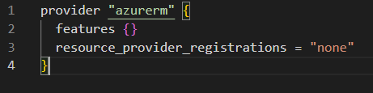

# Práctica 1. Instalación y configuración de OpenTofu en Azure

## Objetivo de la práctica

Al finalizar la práctica, serás capaz de:

- Instalar OpenTofu y las herramientas necesarias para trabajar con Azure.
- Realizar la configuración inicial de OpenTofu en Azure.

## Duración aproximada

- 30 minutos

---

**[⬅️ Atrás](https://netec-mx.github.io/OPE_TOF_EES/Cap%C3%ADtulo4/lab4.html)** | **[Lista General](https://netec-mx.github.io/OPE_TOF_EES/)** | **[Siguiente ➡️](https://netec-mx.github.io/OPE_TOF_EES/Cap%C3%ADtulo2/lab2.html)**

## Instrucciones

### Tarea 1: Requisitos previos

Antes de proceder con la instalación, asegúrate de cumplir con los siguientes requisitos:

**NOTA:** Puedes visitar esta página para validar los requisitos [Instalación de OpenTofu](https://opentofu.org/docs/intro/install/)

**IMPORTANTE:** Para esta práctica se usara el Sistema Operativo **Windows**

1. **Sistema operativo compatible**: 
   - Verificar que tienes Windows 10. Para hacerlo:
     - Presionar `Win + R`, escribir `winver` y presionar `Enter`.
     - Asegúrate de que la versión es Windows 10.
2. **Espacio en disco**: 
   - Comprobar que cuentas con al menos 10 GB de espacio libre:
     - Abrir `Explorador de Archivos` → `Este equipo` → Revisar el almacenamiento disponible.
3. **Permisos de administrador**: 
   - Asegúrate de que tienes permisos de administrador:
     - Hacer clic derecho en `Símbolo del sistema` o `PowerShell` y seleccionar `Ejecutar como administrador`.

**¡TAREA FINALIZADA!**

Ya cuentas con el entorno adecuado para la instalación.

---

### Tarea 2: Instalación de OpenTofu y herramientas de Azure

Sigue los siguientes pasos para instalar las herramientas necesarias:

1. **Instalar Azure CLI**
   - Descargar el instalador desde [Microsoft](https://aka.ms/installazurecliwindows).
   - Ejecutar el instalador `.msi` y seguir las instrucciones en pantalla.
   - Una vez instalado, verificar la instalación con `az --version` en `PowerShell`.

   

2. **Instalar OpenTofu**
   - Descargar el binario de OpenTofu en zip desde [su sitio oficial](https://github.com/opentofu/opentofu/releases/download/v1.9.0/tofu_1.9.0_windows_386.zip).
   - Extraer el archivo `tofu.exe` en una ubicación accesible, por ejemplo: `C:\Program Files\OpenTofu`.
   - **NOTA:** Si no existe la carpeta `OpenTofu` debes crearla.
   - Agregar la ruta de OpenTofu a las variables de entorno:
     - Abrir `Configuración avanzada del sistema` → `Variables de entorno`.
     - En `Path` de `Variables del Sistema`, hacer clic en `Editar` y agregar la ruta donde copiaste `tofu.exe`.
     
     - Guardar los cambios y cerrar la ventana.
   - Verificar la instalación ejecutando en `PowerShell`:
   - **NOTA:** Quizas debas cerrar y abrir de nuevo `Powershell` para que tome efecto la variable.

     ```powershell
     tofu --version
     ```

     
3. **Instalar Visual Studio Code y la extensión de Terraform**
   - Descargar [VS Code](https://code.visualstudio.com/) e instalarlo.
   - **NOTA:** Ya esta instalado en el ambiente, busca el acceso directo para abrirlo y avanza al siguiente punto.
   - Abrir VS Code, ir a `Extensiones` (`Ctrl + Shift + X`) y buscar `HashiCorp Terraform`.
   - Instalar la extensión para facilitar la edición y ejecución de archivos `.tf` en OpenTofu.
   
   

**¡TAREA FINALIZADA!**

Las herramientas de OpenTofu y Azure han sido instaladas correctamente.

---

### Tarea 3: Configuración inicial de OpenTofu en Azure desde Visual Studio Code

1. **Crear la carpeta de trabajo**
   - Abrir Visual Studio Code.
   - Abrir la terminal (`Ctrl + Ñ`) y ejecutar:
     ```powershell
     cd .\Desktop\
     mkdir OpenTofuLabs
     cd OpenTofuLabs
     ```
   - Esta será la carpeta de trabajo para los laboratorios de OpenTofu.
   - Tambien abrela en el visualizador de "VSC", hacer clic en el botón `Open Folder`
   
   - Buscar la carpeta `OpenTofuLabs` y abrirla.
   - Una vez abierta, confirma el autor.
   

2. **Iniciar sesión en Azure**
   - Desde la terminal de VS Code, ejecutar:
     ```powershell
     az login
     ```
   - Se abrirá una ventana en el navegador para iniciar sesión en tu cuenta de Azure.
   
   - Ingresar los datos que se te asignaron al curso.
   - Una vez autenticado, verás los detalles de tu suscripción en la terminal.
   
   - Para confirmar la suscripción escribe `1` o ejecuta `Enter`.

3. **Seleccionar la suscripción correcta (OPCIONAL)**
   - Desde la terminal de VS Code, ejecutar:
     ```powershell
     az account list --output table
     ```
   - Copiar el `id` de la suscripción deseada y usar:
     ```powershell
     az account set --subscription "ID_DE_TU_SUSCRIPCIÓN"
     ```
    - Copiar el `id` de la suscripción deseada y guardarlo en un bloc de notas.

4. **Configurar credenciales de Azure para OpenTofu**
   - Crear un archivo de configuración ejecutando; sustituye el paremetro `ID_DE_TU_SUSCRIPCIÓN` por el valor que copiaste:
     ```powershell
     az ad sp create-for-rbac --display-name="tofurole" --role="Contributor" --scopes="/subscriptions/ID_DE_TU_SUSCRIPCIÓN"
     ```
     
   - Copiar los valores de `appId`, `password` y `tenant` y configúralos como variables de entorno:
   - **NOTA:** Puedes guardarlos en un bloc de notas por si los requieres mas adelate.
     ```powershell
     $env:ARM_CLIENT_ID="appId"
     $env:ARM_CLIENT_SECRET="password"
     $env:ARM_TENANT_ID="tenant"
     $env:ARM_SUBSCRIPTION_ID="ID_DE_TU_SUSCRIPCIÓN"
     ```
     
     
5. **Verificar configuración**
   - Dentro de `OpenTofuLabs`, crear una carpeta específica para este laboratorio:
     ```powershell
     mkdir Lab1_Init
     cd Lab1_Init
     ```
   - Dentro de la carpeta, crear un archivo `providers.tf` con el siguiente contenido:
   
     ```hcl
     provider "azurerm" {
       features {}
     }
     ```
     
   - Ejecutar los siguientes comandos en la terminal de VS Code:
     ```powershell
     tofu init
     ```
     
     ```powershell
     tofu validate
     ```
     
   - Si no hay errores, la configuración es correcta.

**¡TAREA FINALIZADA!**

El entorno de OpenTofu en Azure está listo para su uso dentro de Visual Studio Code.

---

## Resumen

En esta práctica, hemos revisado los requisitos previos, instalado OpenTofu y las herramientas necesarias para trabajar con Azure y configurado el entorno en Windows. Ahora, todo se ejecuta desde Visual Studio Code en la carpeta `OpenTofuLabs`.

---

**[⬅️ Atrás](https://netec-mx.github.io/OPE_TOF_EES/Cap%C3%ADtulo4/lab4.html)** | **[Lista General](https://netec-mx.github.io/README.md)** | **[Siguiente ➡️](https://netec-mx.github.io/OPE_TOF_EES/Cap%C3%ADtulo2/lab2.html)**

---
