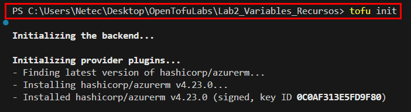
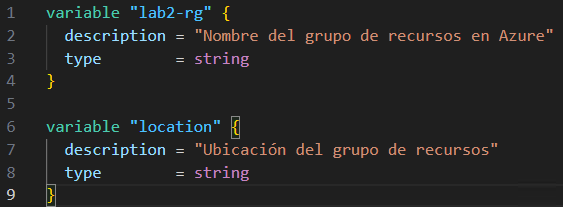
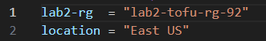
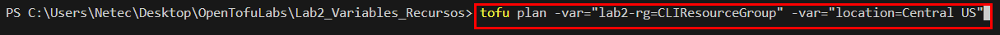
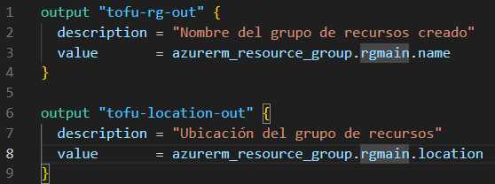
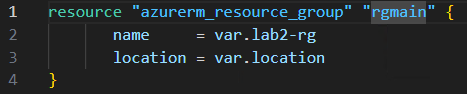
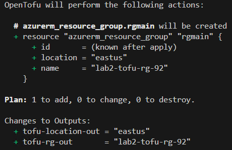
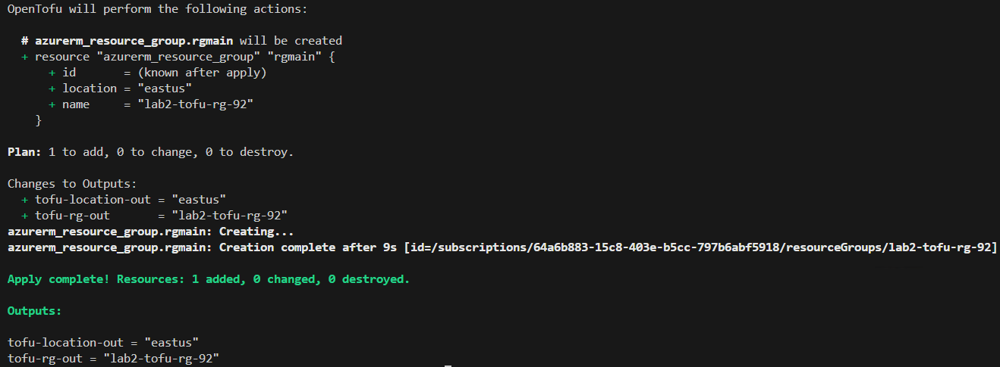
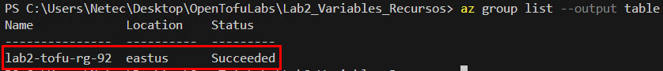

# Práctica 2. Creación de variables, salidas y recursos en OpenTofu

## Objetivo de la práctica

Al finalizar la práctica, serás capaz de:

- Definir y utilizar variables en OpenTofu.
- Configurar y visualizar salidas (outputs).
- Declarar y administrar recursos en Azure mediante OpenTofu.

## Duración aproximada
- 40 minutos.

---

**[⬅️ Atrás](https://netec-mx.github.io/OPE_TOF_EES/Cap%C3%ADtulo1/lab1.html)** | **[Lista General](https://netec-mx.github.io/OPE_TOF_EES/)** | **[Siguiente ➡️](https://netec-mx.github.io/OPE_TOF_EES/Cap%C3%ADtulo3/lab3.html)**

## Instrucciones

### Tarea 1: Configuración del entorno

1. **Abrir Visual Studio Code**
   - Abrir Visual Studio Code.
   - Abrir la terminal (`Ctrl + Ñ`) y navegar a la carpeta de trabajo:
     ```powershell
     cd OpenTofuLabs
     ```

2. **Crear un nuevo directorio para el laboratorio**
   - Dentro de `OpenTofuLabs`, crear una carpeta específica para este laboratorio:
     ```powershell
     mkdir Lab2_Variables_Recursos
     cd Lab2_Variables_Recursos
     cp ..\Lab1_Init\providers.tf .
     ```

3. **Inicializar un proyecto de OpenTofu**
   - Ejecutar el siguiente comando para inicializar OpenTofu en la nueva carpeta:
     ```powershell
     tofu init
     ```
   - Este comando descargará los proveedores necesarios y configurará el entorno para trabajar con OpenTofu.
     

**¡TAREA FINALIZADA!**

---

### Tarea 2: Definición de variables y salidas

1. **Crear y definir variables en un archivo `.tf`**
   - En `Lab2_Variables_Recursos`, crear un archivo llamado `variables.tf` y agregar el siguiente contenido:
     ```hcl
     variable "lab2-rg" {
       description = "Nombre del grupo de recursos en Azure"
       type        = string
     }

     variable "location" {
      description = "Ubicación del grupo de recursos"
      type        = string
     }
     ```
     
     
2. **Definir variables en un archivo `.tfvars`**
   - Crear un archivo `terraform.tfvars` en la misma carpeta y agregar el siguiente contenido:
   **NOTA:** Cambiar las letras `X` por numeros o letras aleatorias.
     ```hcl
     lab2-rg  = "lab2-tofu-rg-XX"
     location = "East US""
     ```
     
   - Este archivo permite definir valores de variables sin modificar `variables.tf`.

3. **Definir variables desde la terminal**
   - Puedes sobrescribir valores al ejecutar OpenTofu con parámetros adicionales:
     ```powershell
     tofu plan -var="lab2-rg=CLIResourceGroup" -var="location=Central US"
     ```
     
   - Este método es útil para configuraciones temporales o personalizadas sin modificar archivos.

4. **Definir salidas (Outputs)**
   - En `Lab2_Variables_Recursos`, crear un archivo llamado `outputs.tf` con el siguiente contenido:
     ```hcl
     output "tofu-rg-out" {
       description = "Nombre del grupo de recursos creado"
       value       = azurerm_resource_group.main.name
     }

     output "tofu-location-out" {
       description = "Ubicación del grupo de recursos"
       value       = azurerm_resource_group.main.location
     }
     ```
     

5. **Verificar la sintaxis**
   - Dentro de la terminal de VS Code, ejecutar:
     ```powershell
     tofu fmt
     ```
   - `tofu fmt` formatea los archivos de configuración.

**¡TAREA FINALIZADA!**

---

### Tarea 3: Declaración y creación de recursos

1. **Crear el archivo principal `main.tf`**
   - En `Lab2_Variables_Recursos`, crear un archivo llamado `main.tf` con el siguiente contenido:
     ```hcl     
     resource "azurerm_resource_group" "main" {
       name     = var.lab2-rg
       location = var.location
     }
     ```
     

2. **Inicializar y planificar la configuración**
   - Desde la terminal de VS Code, ejecutar:
     ```powershell
     tofu init
     tofu plan
     ```
   - `tofu init` inicializa el entorno y descarga dependencias.
   - `tofu plan` genera un plan de ejecución sin aplicarlo, mostrando los cambios que se realizarán en Azure.
   

3. **Aplicar la configuración y crear los recursos**
   - Si el plan es correcto y no hay errores, ejecutar:
     ```powershell
     tofu apply -auto-approve
     ```
   - OpenTofu desplegará los recursos en Azure.

4. **Verificar la creación de recursos**
   - Una vez completado, revisar los valores de salida ejecutando:
     ```powershell
     tofu output
     ```
   - Este comando mostrará los valores definidos en `outputs.tf`, confirmando la creación exitosa del recurso.
   

5. **Validar los recursos en Azure**
   - Desde la terminal, ejecutar:
     ```powershell
     az group list --output table
     ```
     
   - Este comando consultará Azure para verificar que el grupo de recursos se haya creado correctamente.

**¡TAREA FINALIZADA!**

### Tarea Opcional: Nueva variable y aplicación de cambios

**Objetivo:** Crear una nueva variable y usarla en un nuevo grupo de recursos.

- Agregar la siguiente variable llamada `retovar`.
- Agregar el siguiente valor `reto-rg`.
- Dejar la ubicación por defecto.
- Crear un nuevo RG que llame el valor de la nueva variable.
- Agregar un output llamado `reto-out` que devuelva el nombre del RG.

---

## Resumen

En esta práctica, se aprendio a definir variables mediante archivos `.tf`, `.tfvars` y la terminal, configuramos salidas para visualizar información clave, desplegamos un grupo de recursos en Azure con OpenTofu y validamos su correcta ejecución..

---

**[⬅️ Atrás](https://netec-mx.github.io/OPE_TOF_EES/Cap%C3%ADtulo1/lab1.html)** | **[Lista General](https://netec-mx.github.io/OPE_TOF_EES/)** | **[Siguiente ➡️](https://netec-mx.github.io/OPE_TOF_EES/Cap%C3%ADtulo3/lab3.html)**

---
