# Práctica 3. Gestión de cambios en la infraestructura con OpenTofu

## Objetivo de la práctica

Al finalizar la práctica, serás capaz de:

- Aplicar cambios a la infraestructura de manera controlada con OpenTofu.
- Analizar y entender el impacto de los cambios antes de aplicarlos.
- Administrar versiones y modificaciones en la infraestructura en Azure.

## Duración aproximada
- 40 minutos.

---

**[⬅️ Atrás](https://netec-mx.github.io/OPE_TOF_EES1/Cap%C3%ADtulo2/lab2.html)** | **[Lista General](https://netec-mx.github.io/OPE_TOF_EES1/)** | **[Siguiente ➡️](https://netec-mx.github.io/OPE_TOF_EES1/Cap%C3%ADtulo4/lab4.html)**

## Instrucciones

### Tarea 1: Preparación del entorno

1. **Abrir Visual Studio Code**
   - Iniciar Visual Studio Code desde el menú de inicio o con el comando `code` en la terminal.
   - Abrir la terminal integrada con `Ctrl + Ñ` (o `Ctrl + Shift + P` y selecciona `Terminal: New Terminal`).

2. **Navegar a la carpeta de trabajo**
   - Asegúrate de estar en la carpeta principal de trabajo `OpenTofuLabs`:
     ```powershell
     cd OpenTofuLabs
     ```

3. **Crear un directorio para este laboratorio**
   - Crear una carpeta específica para este laboratorio:
     ```powershell
     mkdir Lab3_Gestion_Cambios
     cd Lab3_Gestion_Cambios
     ```
     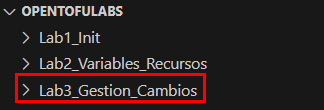

4. **Inicializar un proyecto de OpenTofu**
   - Ejecutar el siguiente comando para inicializar OpenTofu en la nueva carpeta:
     ```powershell
     cp ..\Lab1_Init\providers.tf .
     tofu init
     ```

**¡TAREA FINALIZADA!**

---

### Tarea 2: Aplicación de cambios en la infraestructura

1. **Definir el archivo principal `main.tf`**
   - Crear un archivo llamado `main.tf` y agregar el siguiente contenido:
     ```hcl
     resource "azurerm_resource_group" "alter-rg" {
       name     = "TofuManagedGroup"
       location = "East US"
     }
     ```
     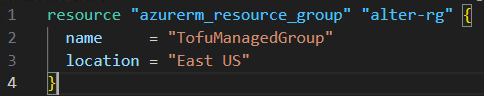

2. **Crear el grupo de recursos en Azure**
   - Ejecutar los siguientes comandos en la terminal de VS Code:
     ```powershell
     tofu plan
     tofu apply -auto-approve
     ```
     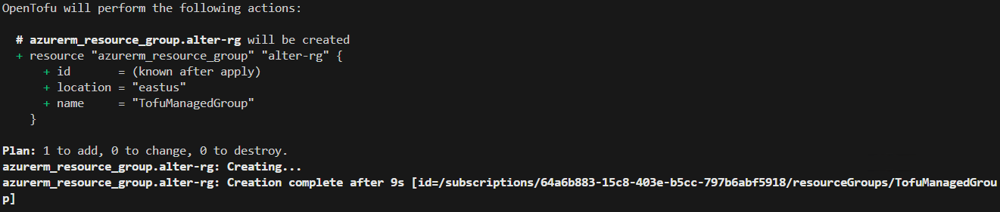
   - Confirmar que el grupo de recursos ha sido creado correctamente en Azure.

3. **Modificar la infraestructura**
   - Abrir `main.tf` y cambiar la ubicación del grupo de recursos:
     ```hcl
     resource "azurerm_resource_group" "main" {
       name     = "TofuManagedGroup"
       location = "West US"
     }
     ```
     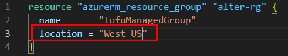

4. **Planificar los cambios**
   - Antes de aplicar el cambio, revisar el impacto con:
     ```powershell
     tofu plan
     ```
     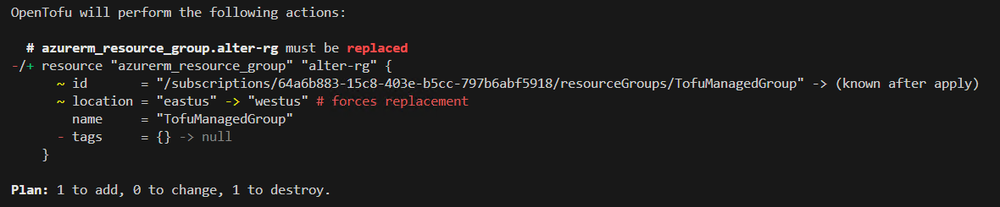

   - Este comando mostrará qué modificaciones se realizarán en Azure.

5. **Aplicar los cambios**
   - Si el plan es correcto, ejecutar:
     ```powershell
     tofu apply -auto-approve
     ```
     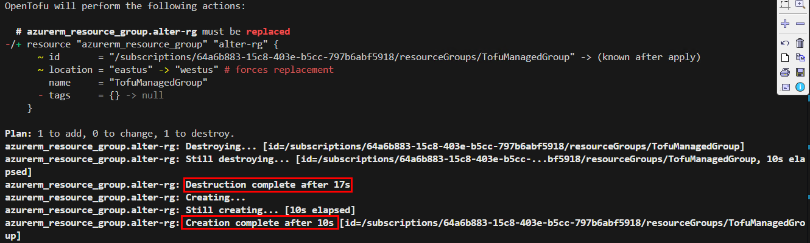
   - Verificar que los cambios hayan sido aplicados correctamente.

**¡TAREA FINALIZADA!**

---

### Tarea 3: Gestión de versiones y auditoría de cambios

1. **Habilitar el control de versiones**
   - Inicializae un repositorio Git en la carpeta del laboratorio:
   - **NOTA:** Esta es una práctica, pero estos archivos normalmente no se suben al repositorio *`**.tfstate, *.tfstate.backup, .tofu/, *.tfplan, *.tfvars, *.tfvars.json, *.log, crash.log`**. Deben agregarse al archivo `.gitignore`
     ```powershell
     git init
     git add .
     git commit -m "Versión inicial de infraestructura"
     ```
     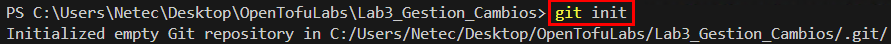
     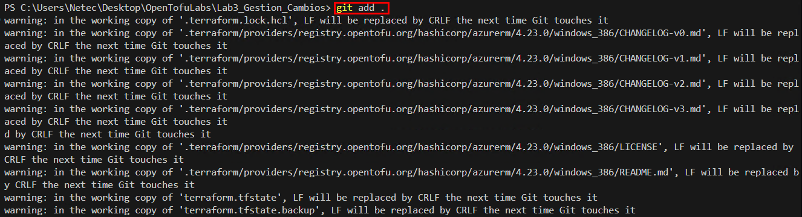
     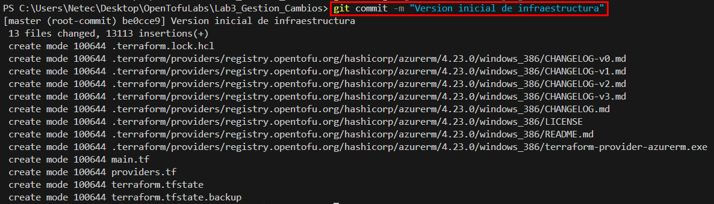

2. **Realizar modificaciones adicionales**
   - Editar `main.tf` para agregar etiquetas al grupo de recursos:
     ```hcl
     resource "azurerm_resource_group" "main" {
       name     = "TofuManagedGroup"
       location = "West US"
       tags = {
         environment = "Development"
         owner       = "Admin"
       }
     }
     ```
     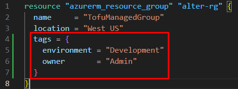

3. **Planificar y aplicar los nuevos cambios**
   - Revisar el impacto antes de aplicar:
     ```powershell
     tofu plan
     ```
     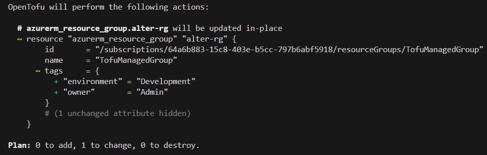
   - Aplicar las modificaciones:
     ```powershell
     tofu apply -auto-approve
     ```
     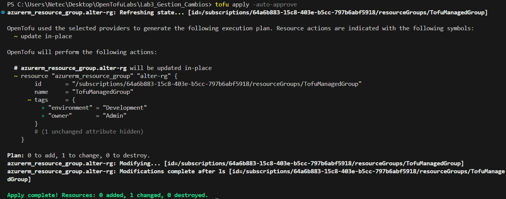

4. **Registrar los cambios en el repositorio**
   - Guardar el estado actual con Git:
     ```powershell
     git add .
     git commit -m "Agregadas etiquetas al grupo de recursos"
     ```
     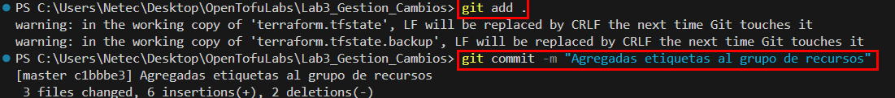

5. **Revisar el historial de cambios**
   - Consultar el historial de modificaciones con:
     ```powershell
     git log --oneline
     ```
     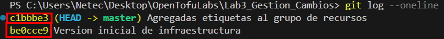

6. **Validar los recursos en Azure**
   - Desde la terminal, ejecutar:
     ```powershell
     az group list
     ```
     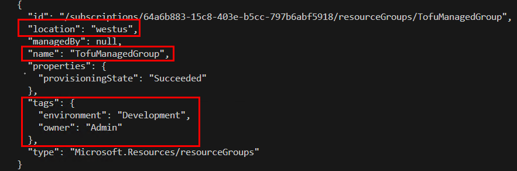

**¡TAREA FINALIZADA!**

---

## Resumen

En esta práctica, aplicamos cambios a la infraestructura con OpenTofu, analizamos su impacto, gestionamos versiones con Git y auditamos modificaciones en Azure, asegurando un control eficiente de los cambios.

---

**[⬅️ Atrás](https://netec-mx.github.io/OPE_TOF_EES1/Cap%C3%ADtulo2/lab2.html)** | **[Lista General](https://netec-mx.github.io/OPE_TOF_EES1/)** | **[Siguiente ➡️](https://netec-mx.github.io/OPE_TOF_EES1/Cap%C3%ADtulo4/lab4.html)**

---
