# Laboratorio 4: Administración de Dependencias entre Módulos en OpenTofu

## Objetivo de la práctica

Al finalizar la práctica, serás capaz de:

- Comprender y gestionar dependencias entre módulos en OpenTofu.
- Organizar la infraestructura en módulos reutilizables.
- Implementar relaciones entre módulos para mejorar la escalabilidad.

## Duración aproximada
- 60 minutos.

---

**[⬅️ Atrás](https://netec-mx.github.io/OPE_TOF_EES1/Cap%C3%ADtulo3/lab3.html)** | **[Lista General](https://netec-mx.github.io/README.md)** | **[Siguiente ➡️](https://netec-mx.github.io/OPE_TOF_EES1/Cap%C3%ADtulo1/lab1.html)**

## Instrucciones

### Tarea 1: Configuración del Entorno

1. **Abrir Visual Studio Code**
   - Inicia Visual Studio Code desde el menú de inicio o con el comando `code` en la terminal.
   - Abre la terminal integrada con `Ctrl + Ñ` (o `Ctrl + Shift + P` y selecciona `Terminal: New Terminal`).

2. **Navegar a la Carpeta de Trabajo**
   - Asegúrate de estar en la carpeta principal de trabajo `OpenTofuLabs`:
     ```powershell
     cd OpenTofuLabs
     ```

3. **Crear un Directorio para este Laboratorio**
   - Crea una carpeta específica para este laboratorio:
     ```powershell
     mkdir Lab4_Dependencias_Modulos
     cd Lab4_Dependencias_Modulos
     ```

4. **Inicializar un Proyecto de OpenTofu**
   - Ejecuta el siguiente comando para inicializar OpenTofu en la nueva carpeta:
     ```powershell
     tofu init
     ```

**¡TAREA FINALIZADA!**

---

### Tarea 2: Creación de Módulos en OpenTofu

1. **Crear la Estructura de Módulos**
   - Dentro de `Lab4_Dependencias_Modulos`, crea un directorio llamado `modules`:
     ```powershell
     mkdir modules
     ```
     
   - Dentro de `modules`, crea dos carpetas para los módulos:
     ```powershell
     mkdir modules/resource_group
     mkdir modules/storage_account
     ```
     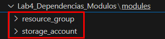

2. **Definir el Módulo de Grupo de Recursos**
   - Dentro de `modules/resource_group`, crea un archivo `variables.tf`.
     ```hcl
     variable "rg-mod" {
       type        = string
       description = "Nombre del grupo de recursos"
     }
     
     variable "loc-mod" {
       type        = string
       description = "Ubicación del grupo de recursos"
     }
     ```
     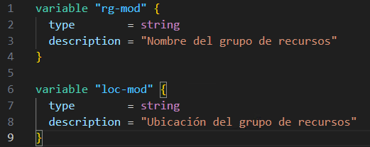

   - Crea un archivo `main.tf` con el siguiente contenido, en la misma carpeta:
     ```hcl
     resource "azurerm_resource_group" "rgmodule" {
       name     = var.rg-mod
       location = var.loc-mod
     }
     ```
     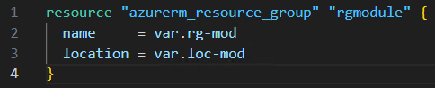
   
   - Crea un archivo `outputs.tf`:
     ```hcl
     output "resource_group_name" {
       value = azurerm_resource_group.main.name
     }
     ```
     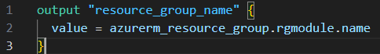

3. **Definir el Módulo de Almacenamiento**
   - Dentro de `modules/storage_account`, crea un archivo `variables.tf`.
     ```hcl
     variable "sa-name" {
       type        = string
       description = "Nombre de la cuenta de almacenamiento"
     }
     
     variable "rg-name" {
       type        = string
       description = "Grupo de recursos donde se creará el almacenamiento"
     }
     
     variable "loc-name" {
       type        = string
       description = "Ubicación de la cuenta de almacenamiento"
     }
     ```
     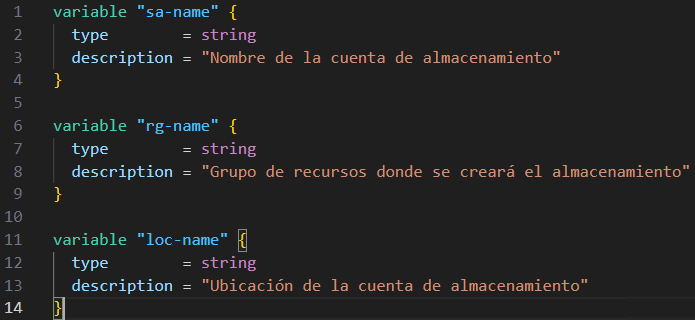

   - Crea un archivo `main.tf` con el siguiente contenido, en la misma carpeta:
     ```hcl
     resource "azurerm_storage_account" "sa-module" {
       name                     = var.sa-name
       resource_group_name      = var.rg-name
       location                 = var.loc-name
       account_tier             = "Standard"
       account_replication_type = "LRS"
     }
     ```
     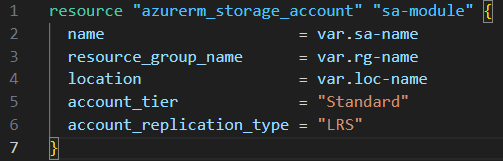
   
   - Crea un archivo `outputs.tf`:
     ```hcl
     output "sa-out" {
       value = azurerm_storage_account.sa-module.name
     }
     ```
     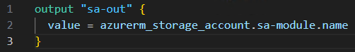

**¡TAREA FINALIZADA!**

---

### Tarea 3: Implementación de los Módulos y Gestión de Dependencias

1. **Crear el Archivo Principal `main.tf`**
   - En `Lab4_Dependencias_Modulos`, crea un archivo `main.tf` con el siguiente contenido:
   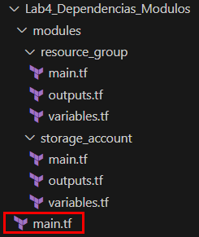
   - **NOTA:** Sustituye las letras `X` por letras y numeros aleatorios, en **minusculas**.
     ```hcl
     provider "azurerm" {
       features {}
     }
     
     module "resource_group" {
       source              = "./modules/resource_group"
       rg-mod              = "RGFromModule"
       loc-mod             = "East US"
     }
     
     module "storage_account" {
       source                = "./modules/storage_account"
       sa-name               = "safrommodulexxxx"
       rg-name               = module.resource_group.resource_group_name
       loc-name              = "East US"
     }
     ```
     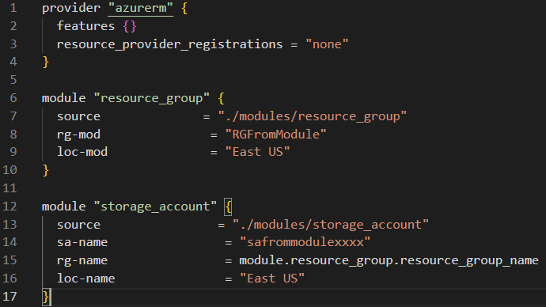

2. **Inicializar y Aplicar la Configuración**
   - Desde la terminal, ejecuta:
     ```powershell
     tofu init
     ```
     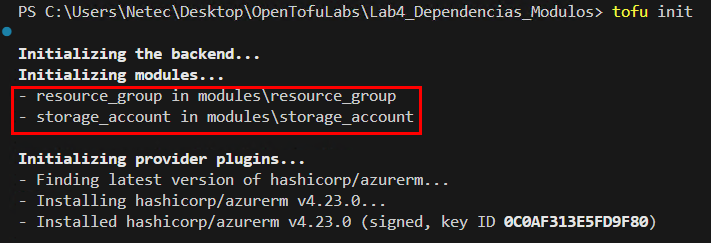
     ```powershell
     tofu plan
     ```
     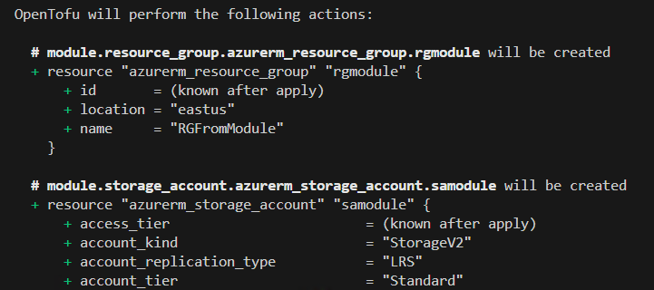

   - `tofu plan` mostrará las dependencias entre los módulos antes de la ejecución.

3. **Aplicar la Configuración y Verificar Resultados**
   - Ejecuta:
     ```powershell
     tofu apply -auto-approve
     ```
     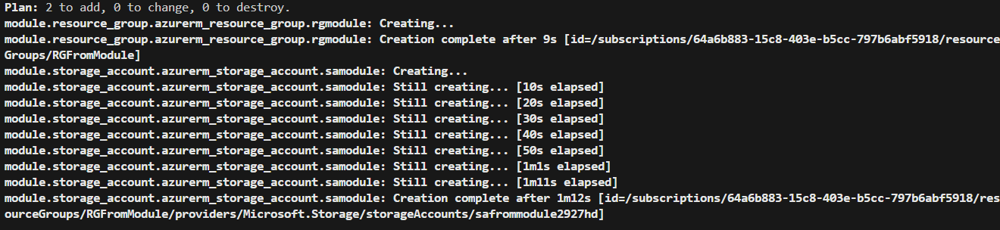

4. **Validar los Recursos en Azure**
   - Desde la terminal, ejecuta:
     ```powershell
     az group list --output table
     ```
     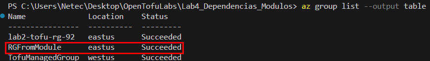
   - Verifica que se haya creado el Storage Account, desde la terminal, ejecuta:
     ```powershell
     az resource list --resource-group RGFromModule --output table
     ```
     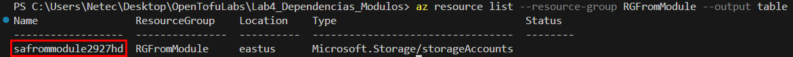

**¡TAREA FINALIZADA!**

---

## Resumen

En esta práctica, aprendimos a gestionar dependencias entre módulos en OpenTofu, organizar la infraestructura en módulos reutilizables y aplicar cambios con propagación automática a los recursos dependientes.

---

**[⬅️ Atrás](https://netec-mx.github.io/OPE_TOF_EES1/Cap%C3%ADtulo3/lab3.html)** | **[Lista General](https://netec-mx.github.io/README.md)** | **[Siguiente ➡️](https://netec-mx.github.io/OPE_TOF_EES1/Cap%C3%ADtulo1/lab1.html)**

---